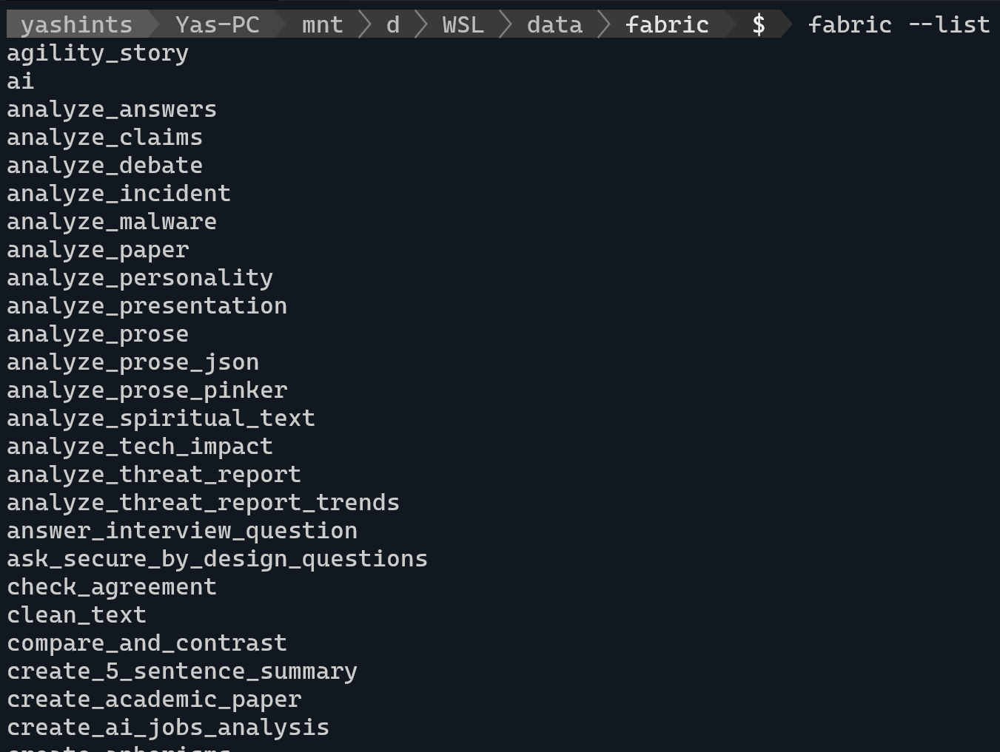

If you have worked with [OpenAI](https://openai.com/) or any other [Generative AI](https://en.wikipedia.org/wiki/Generative_artificial_intelligence) model aka _LLMs_, you would know that writing a good **prompt** is a very key part of how we interact with those models. However, it's often ignored which most probably means people are not getting the most out of these super capable models.

<!--more-->

## The why
The most important part of interacting with LLMs is writing a good prompt, and that's why it is important to make sure not only you know how to write a good prompt, but also are aware of what tools are available which might help you do just that. I wrote this post to introduce [fabric](https://github.com/danielmiessler/fabric) to you all since it has changed the way I personally use my local models and I can't believe how did I not know about it before.

## Introducing fabric
**fabric** is an open source tool which augments humans using AI. I know it sounds a little fancy, but believe me when you get to know its features and usefulness, you would totally be onboard with the definition.

In short, fabric is a tool which not only has many patterns (a comprehensive prompt for a specific purpose) already baked in, but also allows you to use them with LLMs like OpenAI or even local LLMs ([read my last post on how to install Ollama](/blog/2024/05/28/local-llms/)) if you have them handy. Furthermore, you can add your own patterns if you like to the mix too and contribute back to the community if your pattern deemed useful to others.

Enough talking, let's get it installed and show you some cool features.

## Prerequisites
You would need a few things installed to be able to seamlessly install fabric. I am using WSL to install it, but you can install it in a _linux_ distro of your choice.

* **pipx**: fabric uses pipx to install itself, so get it installed by running:
  ```bash
  sudo apt install pipx
  ```
* **python3-dev**: Since it is using Python extensions, you would need to install the header files:
  ```bash
  sudo apt-get install python3-dev
  ```
* **ffmpeg**: Fabric depends on this library and **libavcodec-extra** when handling multimedia:
  ```bash
  sudo apt-get install ffmpeg libavcodec-extra
  ```

## Installing fabric
You wouldn't believe how simple the installation process is. First navigate to a folder where you intend to clone the repository, clone the repo and then navigate into the fabric folder:

```bash
cd /where/you/keep/code
# if the path is a mounted drive you might have to run this with sudo
git clone https://github.com/danielmiessler/fabric.git
cd fabric
```

Now use _pipx_ to install fabric:

```bash
pipx install .
```

Once installed, call the setup function where you have provide four API keys for OpenAI, Claude APIs, Google and YouTube APIs which you can get them from their respective consoles.

```bash
fabric --setup
```

When you are finished, you need to exit bash and go back in to have access to fabric:

```bash
exit
```

And in your terminal:

```powershell
bash
```

Now you can run fabric and see the list of available patterns:

```bash
fabric --list
```

Which should show you the list of available patterns.



## Features

Now let's explore some cool features that will change they way you use LLMs forever. But first, we need to set our default model to make sure we are not charged by OpenAI or other available online models:

```bash
ollama list
# replace the name of the model with whatever you have available
fabric --setDefaultModel llama3:latest
```

Now we're ready to go. First off, let's use one of the features which I use almost every day. I have subscribed to many YouTube channels be it tech or not, and many of those post long videos on a daily basis. You can summarise the whole video using one command:

```bash
yt --transcript https://youtube.com/watch?v=uXs-zPc63kM | fabric --stream --pattern extract_wisdom
```

We're using the `extract_wisdom` pattern here, but you can use any other pattern you want. The API key you provided for YouTube is used here to get the transcript and pass it to the LLM using the pattern you have chosen. Super cool and fast response makes this a really great setup.

Let's try something different:

```bash
echo "An idea that coding is like speaking with rules." | fabric -sp write_essay
```

Here we're passing an idea and ask fabric to call our model and ask for an essay. The result will truly amaze you.


## Taking it to next level

There are two library in macOS called `pbcopy` and `pbpaste` which allow you to copy text from and paste text into your terminal, but at large. Fortunately we can leverage a library which allows us to do exactly that in WSL or any other linux distro called `xclip`. Let's get it installed and running:

```bash
sudo apt install xclip

nano ~/.bashrc
```

Now paste these two lines at the end of the file:

```bash
alias pbcopy='xclip -selection clipboard'
alias pbpaste='xclip -selection clipboard -o'
```

Exit nano with <kbd>Ctrl</kbd> + <kbd>X</kbd>, then enter Y and press <kbd>Enter</kbd>. Last we need to refresh our terminal:

```bash
source ~/.bashrc
```

We're good to go. Navigate to any site which has a long article, I use [this one talking about interest rates in Australia and what might happen in June](https://www.abc.net.au/news/2024-05-30/rba-should-hike-interest-rates-in-june-but-will-it/103909992). Copy all the text in that page and then type this in your terminal:

```bash
pbpaste | fabric -sp extract_insights
```


## What next

There are many cool features you might be interested in, but I just highlight two more which I think are the most practical. Setting a _context_, and adding _custom patters_. Setting a context is done by adding a markdown file called `context.md` in the `./config/fabric/` directory to add context to your pattern. This could be anything you like, for example you might add your goals or the essence of your existence and why you do what you do day to day.

From the custom patterns perspective you can always add your custom patterns which you do not want to upload to fabric in the `~/.config/custom-fabric-patterns` directory. However, whenever you want to use them with fabric you need to move them into the `~/.config/fabric/patterns` directory. Just beware that any time you update fabric, the folder get updated and every custom pattern will be deleted, so you need to copy them from the custom folder before using them.

## Summary
Hope you now have a good cause to go setup fabric and spend a little bit more time with your local LLMs and get better at writing prompts and extracting information or getting what you need faster and more effectively. Stay tuned for more AI content 👋🏽.