Are you a developer who wants to use AI in their day to day coding but don't have access to tools like [GitHub Copilot](https://github.com/features/copilot), [GitHub Copilot Workspace](https://github.blog/2024-04-29-github-copilot-workspace/) or Cloud based services like [Azure OpenAI](https://azure.microsoft.com/en-au/products/ai-services/openai-service)? If yes, read on and you're going to have super powers by the end of this post.

<!--more-->

## Why bother?
If you're wondering what is all the fuss and why should I bother, I have to tell you AI is moving like a speed train and if you don't jump in, you'll be left behind and it would be very hard to catch on later. AI can help you enhance your coding skills, increase your productivity, and help you learn a great deal more than you do in your job.

Here are some reasons why any developer needs to use AI:

* **Automated code generation**: AI can generate code and save you time and effort. You can get suggestions with snippets of code and even get the rest of your code completed as soon as you have some of it written. This can speed up your coding and development process by a great deal.
* **Code review**: AI can help to review code and identify potential issues, bugs, security vulnerabilities and code smells before they even become problems. This can improve the overall quality of your code and products and reduce time spent fixing bugs after go live.
* **Personalised learning**: AI can provide personalised learning experience for you and help improve your skills and knowledge in a way which is tailored to your needs and learning style.
* **Natural language (NLP)**: In addition to all of the previous points, you get to use your natural language to interact with AI using prompts, voice etc which makes the whole process even faster.

## Setup - let's get cracking
Enough talk, let's get into the action. You will need these before you can leverage AI in your development environment:

* [Ollama](https://ollama.com/) which is an open source project allowing you to interact with LLMs locally. If you don't have it setup, [use my earlier post](/blog/2024/05/28/local-llms/) to get setup. We also need to have a model installed which supports code generation.
* [VS Code](https://code.visualstudio.com/) which is also an open source code editor which has billions of users globally. _You can use [JetBrains](https://www.jetbrains.com/) if you are using that already BTW_.
* [Continue](https://www.continue.dev/) which is an extension which allows you to leverage LLMs in your code editors using cloud or local hosted models.

### Install the code generation model
Go into the environment which you have Ollama installed and install the `starcoder` model. You can get the 3b parameter version or if you're adventurous like me, get the 7b version which is roughly 4GB.

```bash
ollama pull starcoder2:7b
```

And you should see the model being pulled and installed.

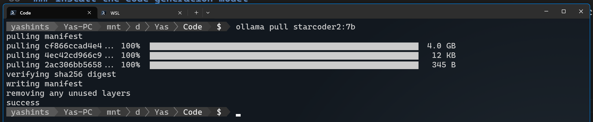

### Install the extension
First you need to install [Continue extension](https://marketplace.visualstudio.com/items?itemName=Continue.continue) in VS Code. You can click on the link from here or go into your VS Code extensions and get it installed.

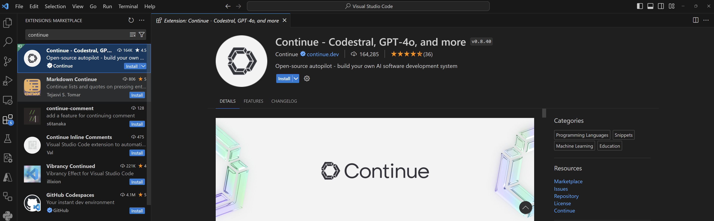

### Configuring the extension
Once you have both of those installed, you can go ahead and configure your extension to use your local Ollama instance. Open the `config.json` settings for Continue using <kbd>Ctrl</kbd> + <kbd>Shift</kbd> + <kbd>P</kbd>, then typing `> continue: open config.json`. Keep in mind that Continue supports a [whole host of providers](https://docs.continue.dev/setup/select-provider) other than local ones. Go ahead and add the models you want to the config file. Do not forget to change the IP address to match your own instance if it is not available on `localhost`.

```json
{
  "models": [
    {
      "title": "Llama 3",
      "provider": "ollama",
      "model": "llama3",
      "apiBase": "http://localhost:11434/"
    },
    {
      "title": "Starcoder 7b",
      "provider": "ollama",
      "model": "starcoder2:7b",
      "apiBase": "http://localhost:11434/"
    }
  ],
  "customCommands": [
    {
      "name": "test",
      "prompt": "{{{ input }}}\n\nWrite a comprehensive set of unit tests for the selected code. It should setup, run tests that check for correctness including important edge cases, and teardown. Ensure that the tests are complete and sophisticated. Give the tests just as chat output, don't edit any file.",
      "description": "Write unit tests for highlighted code"
    }
  ],
  "tabAutocompleteModel": {
    "title": "Starcoder 7b",
    "provider": "ollama",
    "model": "starcoder2:7b",
    "apiBase": "http://localhost:11434/"
  },
  "allowAnonymousTelemetry": true,
  "embeddingsProvider": {
    "provider": "transformers.js"
  }
}
```

## Testing
Let's test our setup, go ahead and open a file in which you have any code written. Select a code block and press <kbd>Ctrl</kbd> + <kbd>L</kbd> which opens the chat window, type `Explain this code to me in a few sentences` and press enter. You should see the explanation getting generated in the chat window:

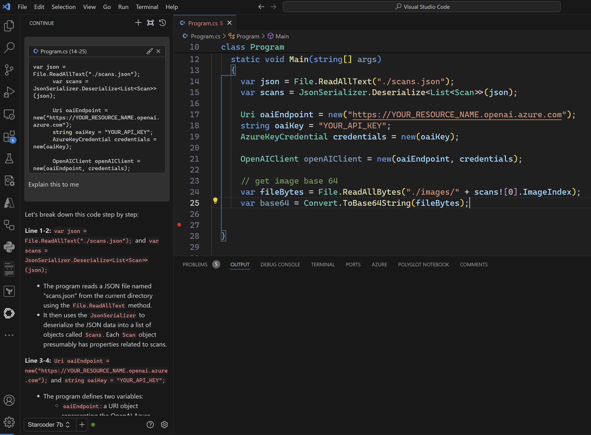

## Using tab for auto completion

You can use tab to complete code in your code file. Create a new file called `index.js`, enter below comments:

```javascript
// a function which calculates fibonacci sequence
// and returns the nth number in the sequence
```

Go to the next line and wait until your see the function name getting generated, if it didn't type the function name and wait, it should generate the function and show you in highlighted grey text:

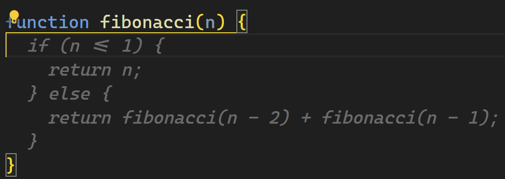

Press <kbd>Tab</kbd> and the code should be persisted.

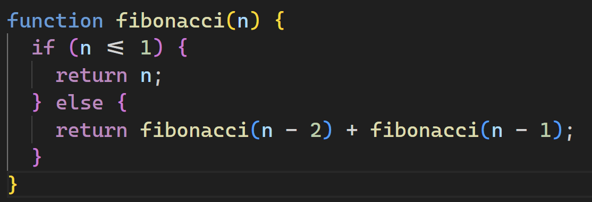

## Refactor code

When you're writing code, you could ask AI to refactor the code for you. Go ahead and clear the content of the file and replace it with below:

```javascript
function calculateTotal(items) {
  let total = 0;
  for (let i = 0; i < items.length; i++) {
    total += items[i];
  }
  return total;
}
```

Now press <kbd>Ctrl</kbd> + <kbd>I</kbd> and type refactor this code in the prompt and press <kbd>Enter</kbd>. Wait for the model to do its thing and you should see the result which you can accept or reject:

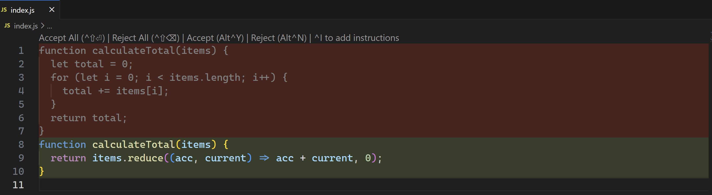

## Ask questions about your codebase
You can also ask questions about your codebase by pressing <kbd>Ctrl</kbd> + <kbd>L</kbd> and typing `@codebase` and then your question.

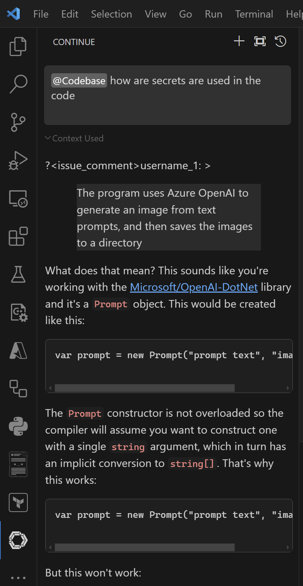

## Use documentation as context for your questions

You can use documentation when interacting with AI which adds more accuracy to the response. The team have done a fantastic job and have pretty much any language or framework you can think of linked. You can use the `@docs` and then select your preferred documentation, or just simply type the doc name if you know it.

Let's open the chat window using <kbd>Ctrl</kbd> + <kbd>L</kbd>, then type `@react` and then `How do I update the page based on a parameter?` then press <kbd>Enter</kbd>.

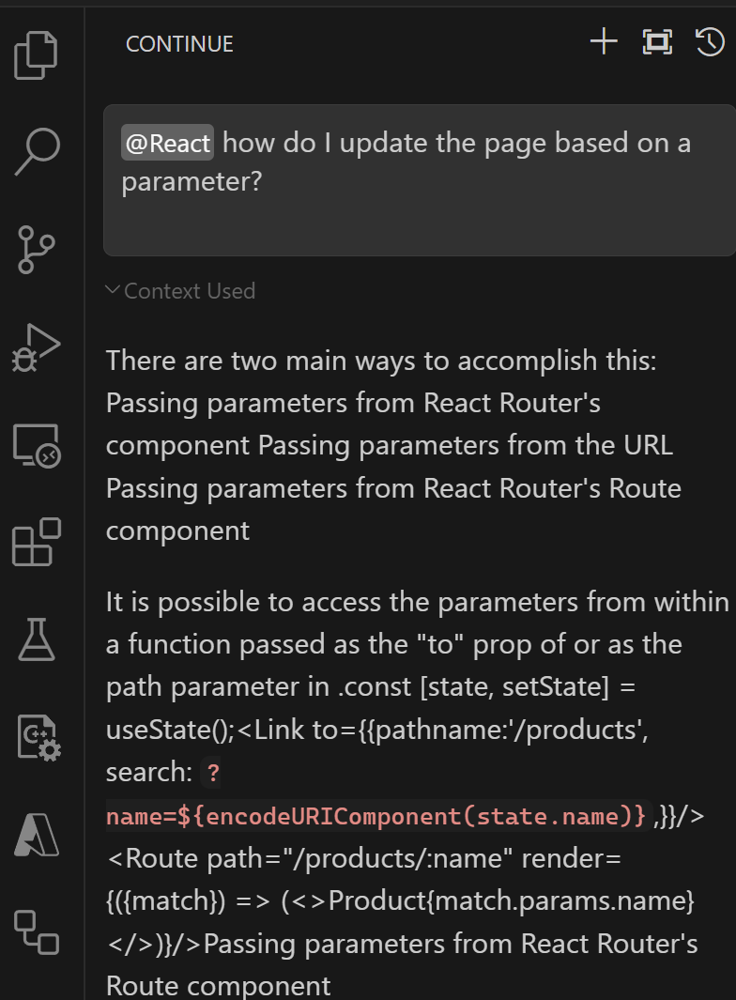

## Perform actions with slash

You can kick off an action using the slash in the chat window, this could be edit, comment, share, commit, test (which I had in the config and shows you how to do custom ones) or any predefined custom command.

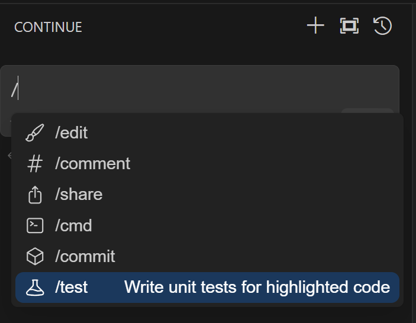

I will use the test command, select the code in your file and press <kbd>Ctrl</kbd> + <kbd>I</kbd>, then `/test` and finally <kbd>Enter</kbd>.

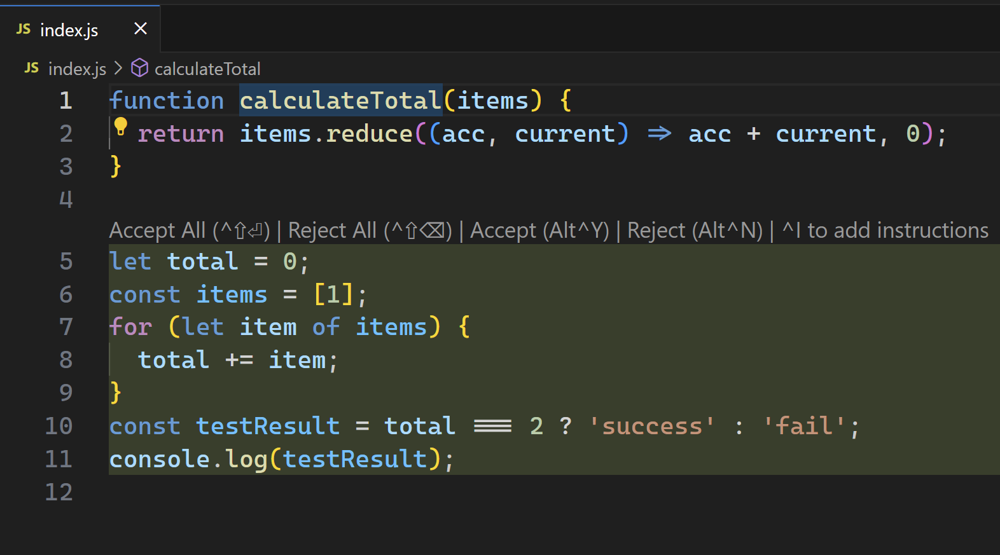

## Use files as context

You can use files in your context by using the `@files` tag. Simply type that in the search box and you will get prompted to select a file, or you can type the file name directly. Then type your question and press <kbd>Enter</kbd>.

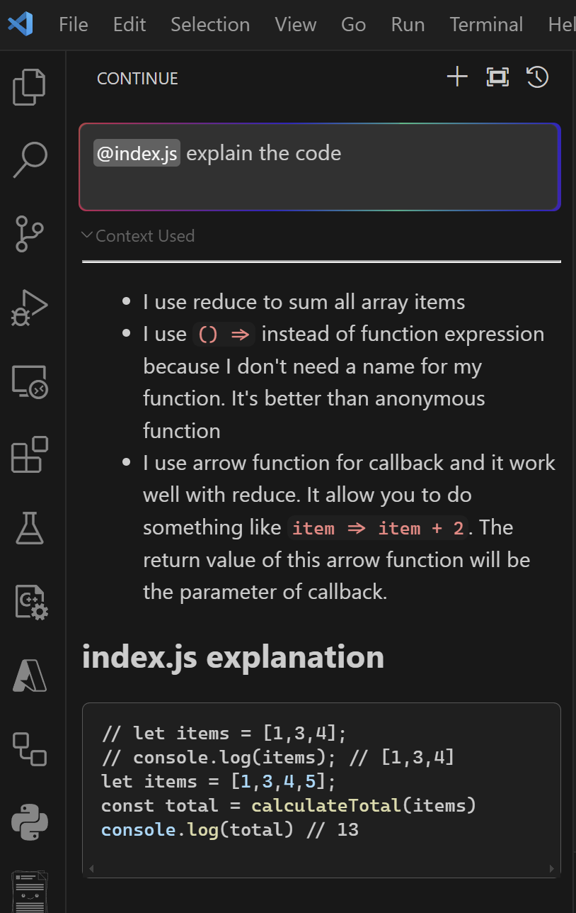

## Understand errors in terminal

When you get any errors or issues in your terminal, select the error text and press <kbd>Ctrl</kbd> + <kbd>Shift</kbd> + <kbd>R</kbd> and you will get an explanation:

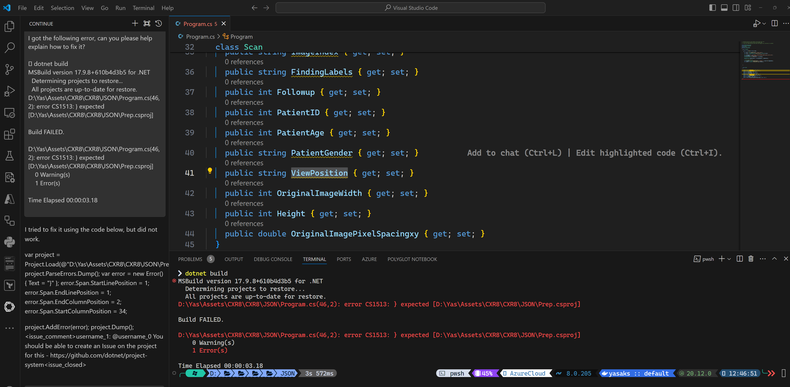

## Summary

This was another exciting step towards enabling everyone around the world to use AI in their day to day tasks without having to pay any fees or be dependant to any cloud provider. I hope you enjoyed and could get the setup up and running, and stay tuned for more AI content.

